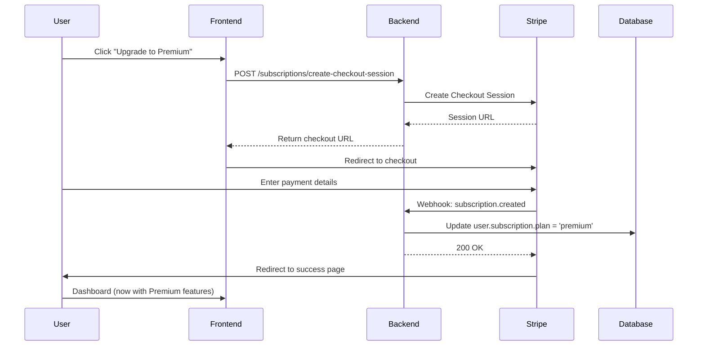

# FicLance Backend API

Production-ready Node.js backend for the FicLance freelance simulation platform.

## Quick Start

```bash
# Install dependencies
npm install

# Setup environment
cp .env.example .env
# Edit .env with your configuration

# Start services (MongoDB, Redis, MinIO)
npm run docker:up

# Run migrations
npm run migrate

# Seed sample data
npm run seed

# Start development server
npm run dev

# In another terminal, start worker
npm run worker
```

The API will be available at `http://localhost:8080/api/v1`

## Environment Variables

See `.env.example` for all required configuration. Key variables:

- `MONGODB_URI` - MongoDB connection string
- `REDIS_URL` - Redis connection string  
- `JWT_ACCESS_TOKEN_SECRET` - Secret for access tokens (min 32 chars)
- `JWT_REFRESH_TOKEN_SECRET` - Secret for refresh tokens (min 32 chars)
- `S3_ENDPOINT`, `S3_BUCKET`, `S3_ACCESS_KEY_ID`, `S3_SECRET_ACCESS_KEY` - S3/MinIO configuration
- `AGENT_SERVICE_URL` - Python agent service URL (default: `http://localhost:8000`)
- `FRONTEND_URL` - Frontend origin for CORS
- `ADMIN_USER_IDS` - Comma-separated user IDs with admin access
- `STRIPE_SECRET_KEY` - Stripe API secret key
- `STRIPE_WEBHOOK_SECRET` - Stripe webhook signing secret
- `STRIPE_PRICE_ID_PREMIUM` - Stripe Price ID for Premium plan
- `STRIPE_PRICE_ID_PRO` - Stripe Price ID for Pro plan

---

## 💳 Subscription Plans

FicLance offers three subscription tiers with different features and limits:

| Feature | Free | Premium ($9.99/mo) | Pro ($19.99/mo) |
|---------|------|-------------------|-----------------|
| **Max Projects** | 5 | 15 | Unlimited |
| **Expertise Levels** | Beginner only | Beginner + Intermediate | All levels |
| **Portfolio Themes** | 1 theme | 3 themes | All themes |
| **Public Portfolio** | ❌ No | ✅ Yes | ✅ Yes |
| **Template Access** | Beginner templates | Beginner + Intermediate | All templates |
| **Support** | Community | Priority | Priority |

### Plan Features

**Free Plan (Default)**
- Perfect for beginners learning the basics
- 5 beginner-level simulation projects
- 1 portfolio theme
- Portfolio is private only
- Access to beginner templates
- No payment required

**Premium Plan** 
- For intermediate learners advancing their skills
- 15 projects (beginner + intermediate difficulty)
- 3 professional portfolio themes
- Public portfolio to showcase your work
- Access to intermediate templates
- Priority support
- **$9.99/month** via Stripe

**Pro Plan**
- For advanced users and professionals
- Unlimited simulation projects
- All portfolio themes unlocked
- Public portfolio enabled
- Access to all template difficulty levels (beginner, intermediate, advanced)
- Advanced features
- Priority support
- **$19.99/month** via Stripe

### Setting Up Stripe

1. **Create Stripe Account**
   - Sign up at https://stripe.com
   - Get your Secret Key from the Dashboard

2. **Create Price Objects**
   ```bash
   # In Stripe Dashboard:
   # Products → Create Product
   # - Name: FicLance Premium
   # - Price: $9.99 USD recurring monthly
   # - Copy the Price ID (starts with price_...)
   
   # Repeat for Pro plan ($19.99/month)
   ```

3. **Configure Environment Variables**
   ```env
   STRIPE_SECRET_KEY=sk_test_...  # or sk_live_... for production
   STRIPE_PRICE_ID_PREMIUM=price_...
   STRIPE_PRICE_ID_PRO=price_...
   ```

4. **Set Up Webhook**
   - In Stripe Dashboard → Developers → Webhooks
   - Add endpoint: `https://your-domain.com/api/v1/webhooks/stripe`
   - Select events:
     - `customer.subscription.created`
     - `customer.subscription.updated`
     - `customer.subscription.deleted`
     - `invoice.paid`
     - `invoice.payment_failed`
   - Copy Webhook Secret and add to `.env`:
     ```env
     STRIPE_WEBHOOK_SECRET=whsec_...
     ```

5. **Test Mode**
   - Use test API keys (sk_test_...) for development
   - Use test card: `4242 4242 4242 4242`
   - No real charges will be made

---

## API Documentation

### Subscription Endpoints

#### `POST /api/v1/subscriptions/create-checkout-session`

Create a Stripe Checkout Session for upgrading to Premium or Pro.

**Auth:** Required

**Request:**
```json
{
  "plan": "premium" // or "pro"
}
```

**Response:** `200 OK`
```json
{
  "success": true,
  "data": {
    "url": "https://checkout.stripe.com/...",
    "sessionId": "cs_test_..."
  }
}
```

**Usage:**
1. Client calls this endpoint
2. Redirect user to the returned `url`
3. User completes payment on Stripe
4. Stripe redirects back to `FRONTEND_URL/dashboard?payment=success`
5. Webhook automatically upgrades user

---

#### `GET /api/v1/subscriptions/status`

Get current user's subscription details including plan, limits, and features.

**Auth:** Required

**Response:** `200 OK`
```json
{
  "success": true,
  "data": {
    "plan": "free",
    "status": "inactive",
    "currentPeriodEnd": null,
    "features": [
      "5 beginner-level projects",
      "1 portfolio theme",
      "Private portfolio only",
      "Beginner templates only"
    ],
    "limits": {
      "maxProjects": 5,
      "allowedExpertise": ["beginner"],
      "allowedThemes": [1],
      "canMakePublic": false
    }
  }
}
```

---

#### `POST /api/v1/subscriptions/cancel`

Cancel subscription at the end of current billing period.

**Auth:** Required

**Response:** `200 OK`
```json
{
  "success": true,
  "data": {
    "plan": "premium",
    "status": "canceled",
    "currentPeriodEnd": "2024-02-01T00:00:00Z",
    "canceledAt": "2024-01-15T10:30:00Z"
  },
  "message": "Subscription will be canceled at period end"
}
```

**Note:** User retains premium features until `currentPeriodEnd`.

---

#### `POST /api/v1/subscriptions/portal`

Get Stripe Billing Portal URL for managing subscription.

**Auth:** Required

**Response:** `200 OK`
```json
{
  "success": true,
  "data": {
    "url": "https://billing.stripe.com/..."
  }
}
```

**Usage:** Redirect user to this URL to manage payment methods, view invoices, cancel subscription.

---

#### `GET /api/v1/limits/check`

Check user's plan limits and current usage.

**Auth:** Required

**Response:** `200 OK`
```json
{
  "success": true,
  "data": {
    "plan": {
      "name": "free",
      "displayName": "Free"
    },
    "limits": {
      "maxProjects": 5,
      "allowedExpertise": ["beginner"],
      "allowedThemes": [1],
      "canMakePublic": false
    },
    "usage": {
      "projectsUsed": 3,
      "projectsRemaining": 2
    },
    "capabilities": {
      "canCreateProject": true,
      "canAccessIntermediate": false,
      "canAccessAdvanced": false,
      "canMakePublic": false
    }
  }
}
```

**Usage:** Frontend checks this before allowing actions (create project, select template, make portfolio public).

---

### Plan Enforcement

The backend enforces plan limits at multiple points:

**Project Creation** (`POST /simulations`)
- Checks if user has reached `maxProjects` limit
- Returns `403 Forbidden` if limit exceeded
- Example error: `"You have reached your plan limit of 5 projects. Please upgrade to create more."`

**Template Access**
- When user selects a template, checks expertise level
- Free users can only access `beginner` templates
- Premium users can access `beginner` + `intermediate`
- Pro users can access all levels
- Returns `403 Forbidden` if template expertise not allowed

**Portfolio Public Toggle** (`PATCH /users/me`)
- Checks if `canMakePublic` is allowed for user's plan
- Free users cannot make portfolio public
- Returns `403 Forbidden` with upgrade message

---

### Webhook Flow



**Webhook Events Handled:**
- `customer.subscription.created` → Activate subscription
- `customer.subscription.updated` → Update subscription status
- `customer.subscription.deleted` → Downgrade to free
- `invoice.paid` → Log payment
- `invoice.payment_failed` → Mark subscription as `past_due`

---

#### `POST /api/v1/auth/register`

Register a new user.

**Request:**
```json
{
  "name": "John Doe",
  "email": "john@example.com",
  "password": "Password123"
}
```

**Response:** `201 Created`
```json
{
  "success": true,
  "data": {
    "_id": "...",
    "name": "John Doe",
    "email": "john@example.com"
  }
}
```

**Rate Limit:** 10 requests per 15 minutes per IP

---

#### `POST /api/v1/auth/login`

Login with email and password.

**Request:**
```json
{
  "email": "john@example.com",
  "password": "Password123",
  "deviceName": "Chrome Browser" // optional
}
```

**Response:** `200 OK`
```json
{
  "success": true,
  "data": {
    "user": { "_id": "...", "name": "John Doe", "email": "john@example.com" },
    "accessToken": "eyJhbGc...",
    "sessionId": "..."
  }
}
```

**Cookies:** Sets `refresh_token` httpOnly cookie

**Rate Limit:** 10 requests per 15 minutes per IP

---

#### `POST /api/v1/auth/refresh`

Refresh access token using refresh token cookie.

**Headers:**
- `Cookie: refresh_token=...`

**Response:** `200 OK`
```json
{
  "success": true,
  "data": {
    "accessToken": "eyJhbGc...",
    "user": { ... }
  }
}
```

**Security:** CSRF protected - validates Origin/Referer headers

---

#### `POST /api/v1/auth/logout`

Logout and revoke session.

**Headers:**
- `Authorization: Bearer {accessToken}`
- `Cookie: refresh_token=...`

**Response:** `200 OK`

**Security:** CSRF protected

---

### User Endpoints

#### `GET /api/v1/users/me`

Get current user profile.

**Auth:** Required

**Response:** `200 OK`
```json
{
  "success": true,
  "data": {
    "_id": "...",
    "name": "John Doe",
    "email": "john@example.com",
    "avatarUrl": "https://...",
    "usage": { "simulationsCount": 5, ... }
  }
}
```

---

#### `PATCH /api/v1/users/me`

Update user profile.

**Auth:** Required

**Request:**
```json
{
  "name": "Jane Doe",
  "about": "Freelance developer",
  "preferences": {
    "darkMode": true,
    "notificationPreferences": {
      "email": false
    }
  }
}
```

---

### Simulation Endpoints

#### `POST /api/v1/simulations`

Create a new simulation.

**Auth:** Required

**Request:**
```json
{
  "projectTemplateId": "...", // optional
  "projectName": "E-commerce Platform",
  "projectDescription": "Build a full e-commerce solution...",
  "filters": {
    "skills": ["JavaScript", "React"],
    "expertise": "intermediate",
    "durationDays": 45
  }
}
```

**Response:** `202 Accepted`
```json
{
  "success": true,
  "data": {
    "simulationId": "...",
    "simulation": { ... }
  },
  "message": "Simulation created and agent job enqueued"
}
```

**Note:** Automatically enqueues requirements agent job

---

#### `GET /api/v1/simulations/:id`

Get simulation details.

**Auth:** Required

**Response:** `200 OK`

---

#### `POST /api/v1/simulations/:id/start`

Start a simulation (transition to `in_progress` state).

**Auth:** Required (must be simulation owner)

---

#### `PATCH /api/v1/simulations/:id/state`

Update simulation state.

**Auth:** Required (must be simulation owner)

**Request:**
```json
{
  "state": "completed" // or "archived", "cancelled"
}
```

---

### Message Endpoints

#### `GET /api/v1/simulations/:simulationId/messages`

List messages for a simulation.

**Auth:** Required

**Query Params:**
- `cursor` - Sequence number for pagination (optional)
- `limit` - Max messages to return (default: 50, max: 100)

**Response:** `200 OK`
```json
{
  "success": true,
  "data": {
    "items": [
      {
        "_id": "...",
        "simulationId": "...",
        "sequence": 1,
        "sender": { "type": "user", "id": "..." },
        "content": "Hello!",
        "contentType": "text",
        "createdAt": "2024-01-01T00:00:00Z"
      }
    ],
    "nextCursor": 51,
    "hasMore": true
  }
}
```

**Note:** Messages use atomic sequence generation to prevent race conditions

---

#### `POST /api/v1/simulations/:simulationId/messages`

Create a new message.

**Auth:** Required

**Request:**
```json
{
  "content": "This is a message",
  "contentType": "text", // or "markdown", "code"
  "attachments": [], // optional
  "clientMessageId": "uuid" // optional for idempotency
}
```

**Response:** `201 Created`

**Socket.IO Event:** Broadcasts `message:created` to simulation room

---

### Portfolio Endpoints

#### `POST /api/v1/portfolio/analyze`

Analyze a GitHub repository.

**Auth:** Required

**Request:**
```json
{
  "repoUrl": "https://github.com/user/repo",
  "branch": "main", // default
  "commitHash": "abc123", // optional
  "simulationId": "..." // optional
}
```

**Response:** `202 Accepted`
```json
{
  "success": true,
  "data": {
    "portfolioId": "...",
    "portfolio": {
      "_id": "...",
      "status": "queued",
      ...
    }
  },
  "message": "Repository analysis enqueued"
}
```

**Note:** Automatically enqueues repo analysis worker job. Duplicate detection prevents re-analyzing same repo/branch/user combination.

---

#### `GET /api/v1/portfolio/:id`

Get portfolio analysis results.

**Auth:** Required

**Response:** `200 OK`

---

#### `POST /api/v1/portfolio/:id/retry`

Retry a failed analysis.

**Auth:** Required (must be portfolio owner)

---

### File Endpoints

#### `POST /api/v1/files/presign`

Get presigned URL for file upload.

**Auth:** Required

**Request:**
```json
{
  "filename": "avatar.jpg",
  "contentType": "image/jpeg",
  "sizeBytes": 102400
}
```

**Response:** `200 OK`
```json
{
  "success": true,
  "data": {
    "fileId": "...",
    "uploadUrl": "https://s3...",
    "key": "uploads/userId/fileId.jpg",
    "expiresIn": 900
  }
}
```

**Note:** Upload to `uploadUrl` using PUT request, then call `/files/complete`

---

#### `POST /api/v1/files/complete`

Mark file upload as complete.

**Auth:** Required

**Request:**
```json
{
  "fileId": "...",
  "url": "https://s3..."
}
```

---

### Template Endpoints

#### `GET /api/v1/templates`

List project templates.

**Auth:** Not required

**Query Params:**
- `tags` - Filter by tags (array)
- `skills` - Filter by required skills (array)
- `expertise` - Filter by expertise level
- `q` - Search query
- `limit`, `skip` - Pagination

---

#### `GET /api/v1/templates/:id`

Get template details.

**Auth:** Not required

---

#### `POST /api/v1/templates`

Create a new template.

**Auth:** Required (admin only)

---

#### `PATCH /api/v1/templates/:id`

Update a template.

**Auth:** Required (admin only)

**Note:** Auto-increments `version` when major fields change

---

### Admin Endpoints

#### `GET /api/v1/admin/jobs`

List jobs and queue statistics.

**Auth:** Required (admin only)

**Response:** `200 OK`
```json
{
  "success": true,
  "data": {
    "queueStats": {
      "agentQueue": { "waiting": 0, "active": 1, ... },
      "repoAnalysisQueue": { "waiting": 2, ... },
      "cleanupQueue": { ... }
    },
    "jobs": {
      "items": [...],
      "total": 50
    }
  }
}
```

---

### Health Check

#### `GET /api/v1/health`

Check system health.

**Auth:** Not required

**Response:** `200 OK` or `503 Service Unavailable`
```json
{
  "success": true,
  "data": {
    "status": "healthy",
    "timestamp": "2024-01-01T00:00:00Z",
    "services": {
      "database": "connected",
      "redis": "connected",
      "s3": "configured"
    }
  }
}
```

---

## Socket.IO Events

Connect to Socket.IO with JWT authentication:

```javascript
const socket = io('http://localhost:8080', {
  auth: { token: accessToken }
});
```

### Client → Server Events

- `join:simulation` - Join simulation room
  ```javascript
  socket.emit('join:simulation', simulationId);
  ```

- `leave:simulation` - Leave simulation room
  ```javascript
  socket.emit('leave:simulation', simulationId);
  ```

- `typing:start` - Indicate user is typing
  ```javascript
  socket.emit('typing:start', { simulationId });
  ```

- `typing:stop` - Indicate user stopped typing
  ```javascript
  socket.emit('typing:stop', { simulationId });
  ```

### Server → Client Events

- `joined:simulation` - Confirmation of room join
- `left:simulation` - Confirmation of room leave
- `message:created` - New message in simulation
- `message:edited` - Message was edited
- `typing:start` - Another user started typing
- `typing:stop` - Another user stopped typing
- `simulation:stateChanged` - Simulation state updated

---

## Error Responses

All errors follow this format:

```json
{
  "success": false,
  "data": null,
  "error": "Error message",
  "errors": [ // For validation errors
    {
      "field": "email",
      "message": "Email is required"
    }
  ]
}
```

**Common HTTP Status Codes:**
- `400` - Bad Request (validation errors)
- `401` - Unauthorized (missing/invalid token)
- `403` - Forbidden (insufficient permissions)
- `404` - Not Found
- `429` - Too Many Requests (rate limit exceeded)
- `500` - Internal Server Error

---

## Running Tests

```bash
# Run all tests with coverage
npm test

# Run tests in watch mode
npm run test:watch

# Run only integration tests
npm run test:integration
```

Tests use `mongodb-memory-server` for isolated database testing.

---

## Migrations

Run database migrations:

```bash
npm run migrate
```

**Migrations:**
1. `001-add-analysisRequestHash` - Adds hash field to Portfolio for duplicate detection
2. `002-backfill-templateSnapshot` - Backfills template snapshots in Simulations

---

## Seeding Data

Seed sample templates and create admin user:

```bash
npm run seed
```

**Creates:**
- 4 sample project templates
- Admin user: `admin@ficlance.com` / `Admin123!` (CHANGE IN PRODUCTION!)

**Note:** Add admin user ID to `ADMIN_USER_IDS` env var after seeding

---

## Architecture

- **Entry Points:** `server.js` (HTTP/Socket.IO), `worker.js` (Background jobs)
- **Services:** Business logic layer (auth, user, simulation, message, portfolio, file)
- **Controllers:** Thin HTTP handlers calling services
- **Models:** Mongoose schemas with validation
- **Workers:** BullMQ processors for agent calls, repo analysis, cleanup
- **Socket.IO:** Real-time messaging with Redis adapter for scaling

---

## Security Features

✅ JWT access tokens with refresh token rotation  
✅ HttpOnly, Secure, SameSite cookies  
✅ CSRF protection on refresh/logout endpoints  
✅ Rate limiting on auth endpoints  
✅ Input validation (Joi schemas)  
✅ Password hashing (bcrypt, 12 rounds)  
✅ Helmet security headers  

---

## Production Deployment

1. Set all environment variables (use strong secrets!)
2. Set `NODE_ENV=production`
3. Run migrations: `npm run migrate`
4. Start server: `npm start`
5. Start worker: `npm run worker`
6. Configure reverse proxy (nginx) with SSL
7. Set up process manager (PM2)

**Scaling:**  
- Multiple server instances behind load balancer
- Redis adapter enables Socket.IO scaling
- Worker instances can be scaled independently

---

## License

MIT
